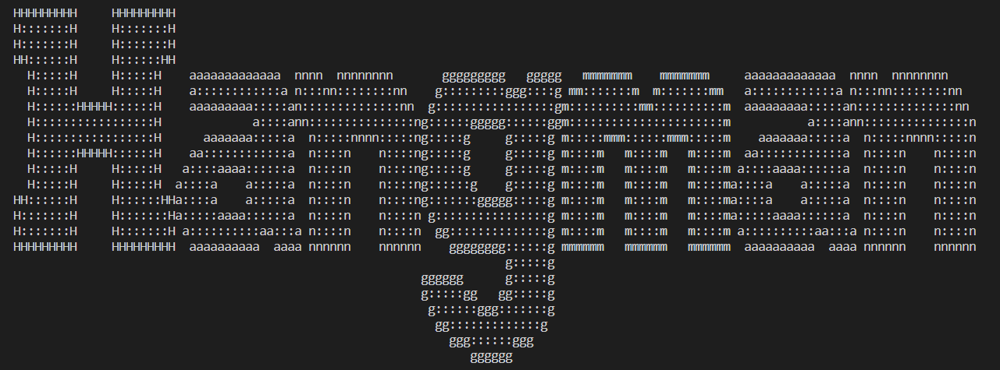
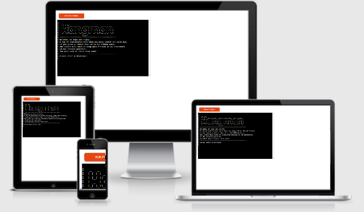
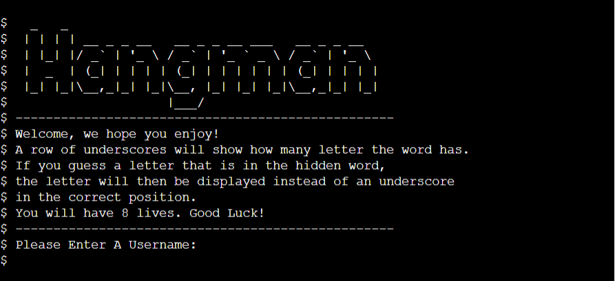
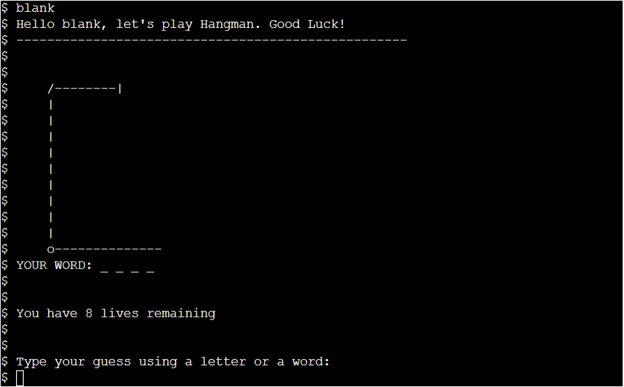
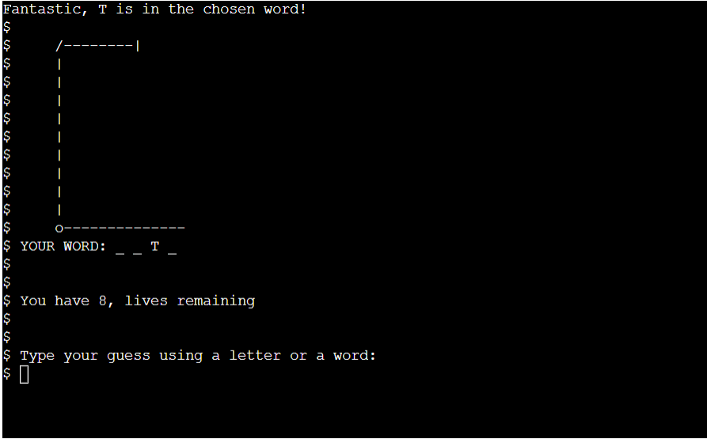
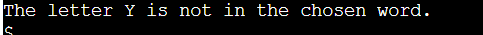
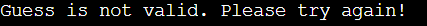

# Hangman

This is a python termianl based game based on the original Hangman game. This will be deployed and ran
using Code Institutes mock terminal on Heroku. Hangman is a very well known word guessing game, the rules
are simple. Guess the word before its to late and all the man is shown on the Hangman board and the game
is over. The user is able to guess letters and words, for each letter or word incorrect a life is lost. 
To win you have to guess the word correctly, if you fail you lose. for more information on this game 
please see [Hangman Wiki](https://en.wikipedia.org/wiki/Hangman_(game)) 

Here you can find a demo of the deployed game [here](https://mats-hangman.herokuapp.com/)

---

## How To Play

Hangman is a simple word guessing game the rules are as follows...

1. You will be welcomed to the game and asked to insert a username of you choice. 
2. Once you have chosen your username the game will welcome you in and the game board will be shown.
3. There will be a random word chosen for you which will be represented by underscores on your gameboard.
4. You will be show the amount of lives you have followed by the question "which letter or word would you like to guess?".
5. You can guess letters or a word depending on what you choose by typing it on your keyboard. 
6. if that letter or word is in the word chosen at random for you, it will then appear instead of an underscore. 
7. if that letter or word is not in the word then an extra piece of the hangman will be displayed and a life will be lost. 
8. Contine this until the game is over and you have won or lost. 
9. When the game has ended you will be asked if you would like to play again, simply type the letter y or n for yes or no.

 
## Features

#### 2.1. Existing Features

* Main start game screen
  * Displays the main welcome board with a title and a welcome message.
  * Asks you to choose a username.

  

* Main game board
  * Displays a welcome message including the chosen username
  * Shows the user an empty hangman image and lives remaining 
  * Displays the chosen word (Your Word) represented by underscores
  * Asks the question of what you would like to guess.

  

* Guessing a correct answer
  * Reveals the guessed letter where the underscores are.
  * Message telling you that it was a correct guess.

  

* Guessing Incorrect answer
  * Message is displayed showing the incorrect guess.
  * a life is lost and a piece of the hangman is displayed.

  

* Invalid guess
  * Message is displayed showing it was an invalid guess.
  * message is displayed if you have already used the same letter or word. 

  

* Winning or loosing the game
  * A message is displayed depending on a win or a loss.
  * User will be asked if they wish to play again. 

  

#### 2.2. Future Features
- There could be an option for difficulty level to increase words to a harder or easier level depending on the user.
- Images could be improved graphically.
- Hints could be added to help the user guess the word. 

---

## Data Model
I decided to use the play function to run my entire game with multiple of other functions that work alongside it. 
The play game function contains the game board that is diplayed including the welcome message and the end game results,
as well as containing a while loop which loops through all the different possibilities in my game such as, validating the 
users input to make sure the users guess is a correct or incorrect guess, to check if what was inputted is valid and usable. This will take 3 different if elif else statments to run through and validate code. This will loop through until the end of the game.

I have a choose word function which is passes to the play function. This chooses a word at random to begin the game, along with the clear sceen function which is used at a certain stage of the play function to keep the game board looking clean and tidy. finally I used a main function this allows the game to start and also asks the user if they wish to play again once the game has ended, followed by a small if statment. This if statment allows the script to run on the command line. 

I have also designed a flowchart stating the steps that I visualised how I wanted the user to see the game, the flowchart starts from the top and works its way down follow the arrows in the directions that come from a spesific process box that you are in. 
Please see my [Flowchart here](assets/images//Flowchart.jpg)

---

## Testing

Please see the testing process [here](TESTING.md)

---

## Deployment

**How to deploy the project**

Hosted on github pages

*Steps for deployment:
  1. Fork or clone this repository.
  2. Create a new Heroku app.
  3. Set the buildpacks to **Python** and **NodeJS** in that order.
  4. Link the Heroku app to the repository.
  5. Click on Deploy.

---

## Credits
- [Code Grabber](https://www.codegrepper.com/code-examples/python/how+to+clear+the+console+in+python) - Used to help clear screen, attmepted using os.system("cls") however I kept getting an error.
- [Youtube](https://www.youtube.com/watch?v=m4nEnsavl6w&t=191s) - Helped structure code and decide how I was going to lay out my code
- [YouTube](https://www.youtube.com/watch?v=3_CX0aD9Fdg) - Helped with adding the more advanced features such as images, dictionary for my words.

### 6.1. Media
- [ASCII Art Generator](https://patorjk.com/software/taag/#p=display&f=Doh&t=Hangman) - Used to create the hangman image
- [Smartdraw](https://www.smartdraw.com/flowchart/flowchart-maker.htm) - Used to design my flowchart.

### 6.2. Acknowledgements
[Precious Ijege](https://www.linkedin.com/in/precious-ijege-908a00168/?originalSubdomain=ng) for the incredible mentoring support.

The [Code Institute](https://codeinstitute.net/) student care and mentors.  
