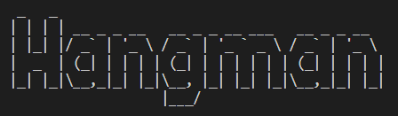

# Hangman

This is a python termianl based game based on the original Hangman game. This will be deployed and ran
using Code Institutes mock terminal on Heroku. Hangman is a very well known word guessing game, the rules
are simple. Guess the word before its to late and all the man is shown on the Hangman board and the game
is over. The user is able to guess letters and words, for each letter or word incorrect a life is lost. 
To win you just have to guess the word correctly, if you fail you lose. for more information on this game 
please see [Hangman Wiki](https://en.wikipedia.org/wiki/Hangman_(game)) 

Here you can find a demo of the deployed game [here]()

Here you will find screenshots of the deployed game [here]()

---

## How To Play
 
## Features

#### 2.1. Existing Features

#### 2.2. Future Features
- 

---

## Data Model

---

## Testing

Please see the testing process [here](testing.md)

---

## Deployment

**How to deploy the project**

Hosted on github pages

1. 

---

## Credits
- [Code Grabber](https://www.codegrepper.com/code-examples/python/how+to+clear+the+console+in+python) - Used to help clear screen, attmepted using os.system("cls") however i kept getting an error.
- [Youtube](https://www.youtube.com/watch?v=m4nEnsavl6w&t=191s) - Helped structure code and decide how i was going to lay out my code
- [YouTube](https://www.youtube.com/watch?v=3_CX0aD9Fdg) - Helped with adding the more advanced features such as images, dictionary for my words.

### 6.1. Media
- [ASCII Art Generator](https://patorjk.com/software/taag/#p=display&f=Doh&t=Hangman) - Used to create the hangman image

### 6.2. Acknowledgements
[Precious Ijege](https://www.linkedin.com/in/precious-ijege-908a00168/?originalSubdomain=ng) for the incredible mentoring support.
The [Code Institute](https://codeinstitute.net/) student care and mentors.  
