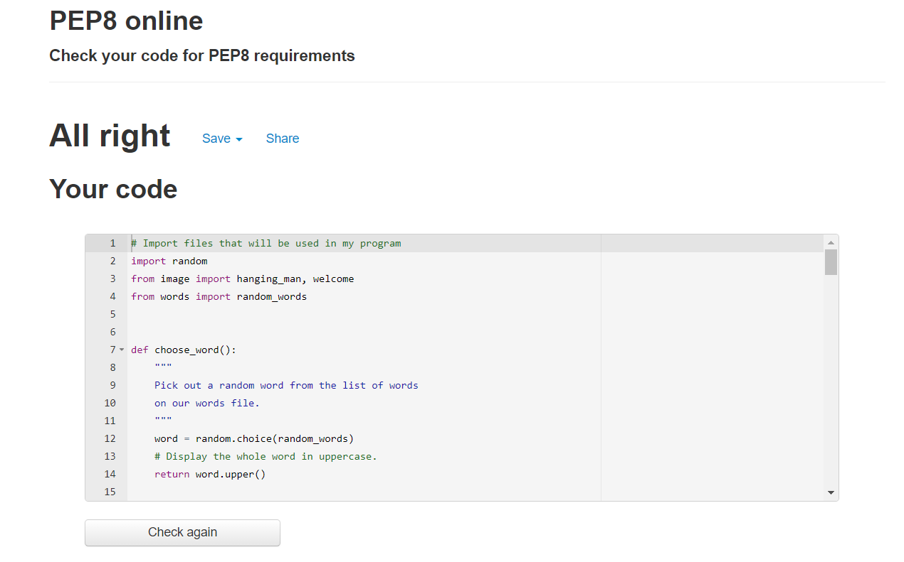
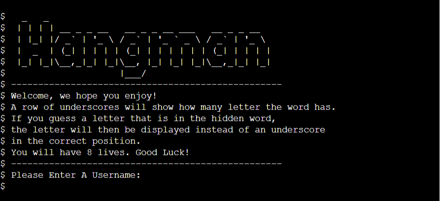
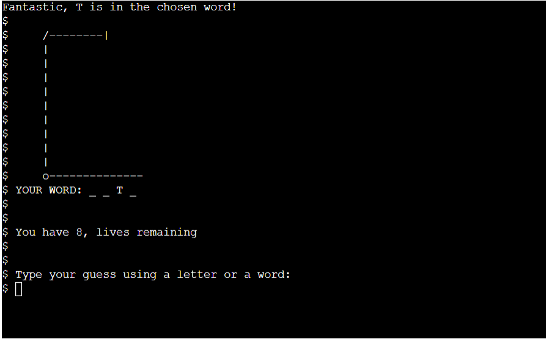
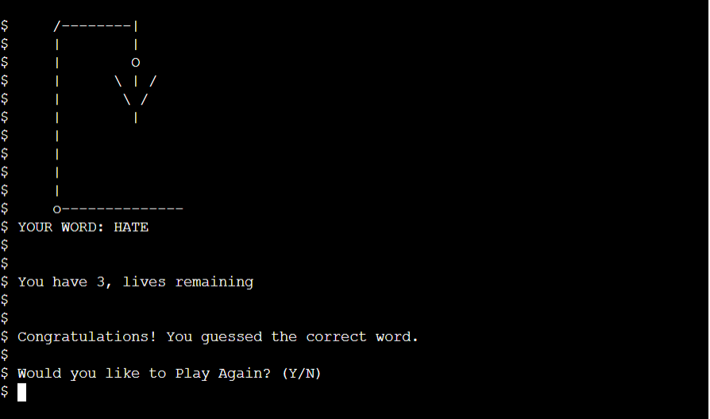

# Testing

## Starting off with validation of the code

[PEP8 Validator](http://pep8online.com/)

#### Deployment Test

---

## Current Bugs
- On my image.py file I have numerous caution problems these are due to creating the hangman images and are of no issue to
  to the game itself or of the PEP8 validation for my main python code.
  

#### Bugs that have been fixed
- I originally created this program without a play function and used a board class as the main way of running the code.
  I found that this caused me a big issue with adding validation and including all the featurs that I wanted to design. 
  I decided to redesign my idea which meant re writing much of my program. This did fix this issue and currently there are
  no bugs.

- I found that when playing my game the console would fill up way to much when playing and guessing answers to I decided to 
  do some research and found a solution to clearing the console after each go which helped with the layput of the game inside the console.

- I noticed a bug where when running on heroku the eneter your username question wouldnt show until a key was pressed, after some 
  research i found on the slack community that adding a \n is what was needed to fix this bug.

- Had a bug where no gaps were showing in the underscore to symbolise how many letters were needed. I fixed this using a new
  variable which i added to change a space from the show variable to an empty string in the new show_word variable. 

Head back to the [ReadMe file](README.md)